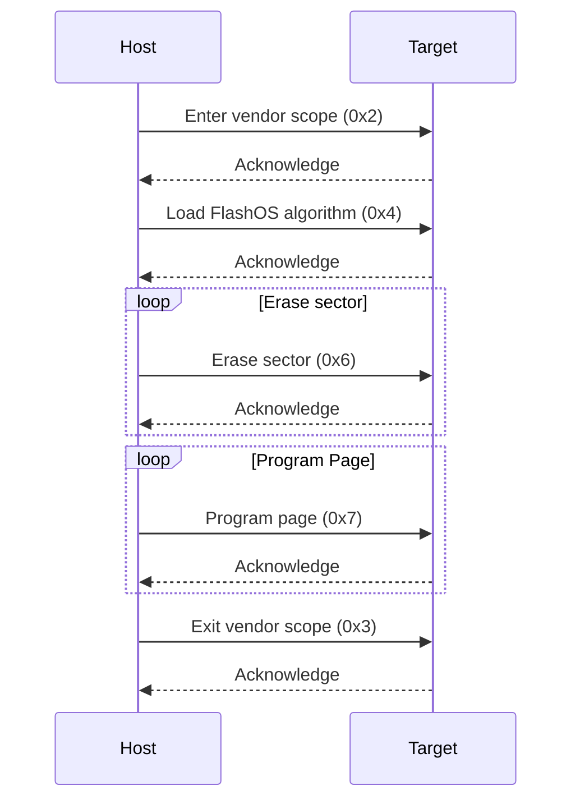

# elaphureLink Vendor Command

ElaphureLink defines a series of vendor commands, which are extensions and supplements to the native CMSIS-DAP commands.

> For more information about CMSIS-DAP command, see [CMSIS-DAP Vendor Commands](https://arm-software.github.io/CMSIS_5/DAP/html/group__DAP__Vendor__gr.html)

[TOC]

## Common Request/Response

All elaphureLink Vendor Commands adhere to the same request/response format. Different commands have distinct command types and payloads.

The common request packet format is defined as follows:

```
  0                   1                   2                   3
  0 1 2 3 4 5 6 7 8 9 0 1 2 3 4 5 6 7 8 9 0 1 2 3 4 5 6 7 8 9 0 1
 +---------------+----------------+------------------------------+
 |    Prefix     |  Command Type  |   Extended Command Type      |
 |      (8)      |       (8)      |            (16)              |
 |               |                |    (if command type > 127)   |
 |               |                |                              |
 +---------------+----------------+- - - - - - - - - - - - - - - +
 |        Payload Length          |         Payload Data         |
 |            (16)                |                              |
 |                                |                              |
 +--------------------------------+- - - - - - - - - - - - - - - +
 :                     Payload Data continued ...                :
 + - - - - - - - - - - - - - - - - - - - - - - - - - - - - - - - +
 |                     Payload Data continued ...                |
 +---------------------------------------------------------------+
```

**Prefix:  8 bits**
    Indicates that this is elaphureLink vendor command. Must be `0x88`.

**Command Type:  8 bits, 8+16 bits**
    The type of the command, in bytes: if 0-127, that is the command type.  If greater than 127 (128-255), the following 2 bytes interpreted as a 16-bit unsigned integer are the command type.

**Payload Length :  16 bits**
    The length of the "Payload data".

**Payload Data:  x bytes**
    The payload data can be of variable length and is used to carry the information specific to the command request.

----

The common response packet format is defined as follows:

```
 0                   1                   2                   3
 0 1 2 3 4 5 6 7 8 9 0 1 2 3 4 5 6 7 8 9 0 1 2 3 4 5 6 7 8 9 0 1
+---------------+----------------+------------------------------+
|    Prefix     |      Status    |         Payload length       |
|      (8)      |       (8)      |              (16)            |
|               |                |                              |
+---------------+----------------+- - - - - - - - - - - - - - - +
|                         Payload Data                          |
+ - - - - - - - - - - - - - - - - - - - - - - - - - - - - - - - +
:                     Payload Data continued ...                :
+ - - - - - - - - - - - - - - - - - - - - - - - - - - - - - - - +
|                     Payload Data continued ...                |
+---------------------------------------------------------------+
```

**Prefix:  8 bits**
    Indicates that this is elaphureLink vendor command. Must be `0x88`.

**Status:  8 bits**
    Indicates the status of the response. The following values are defined.

- **%x0** denotes command successfully completed.
- **%x1** denotes command execution failed.
- **%x2** denotes command is pending.
-  All other values are reserved for future use and MAY be considered as execution failure.

**Payload Length :  16 bits**
    The length of the "Payload data".

 **Payload Data:  x bytes**
    The payload data can be of variable length and is used to carry the information specific to the command response.

## Command Type

The elaphureLink vendor commands are distinguished by their command type. The following table lists all command type values:

| Command Name | Command Type | Requirement |
| ------------ | --------------- | ------------ |
| el_capability | 0x0 | Required |
| el_native_command_passthrough | 0x1 | Optional |
| el_vendor_scope_enter | 0x2 | Optional |
| el_vendor_scope_exit | 0x3 | Optional |
| el_flashos_load_algorithm | 0x4 | Optional |
| el_flashos_execute_function | 0x5 | Optional |
| el_flashos_erase_sector | 0x6 | Optional |
| el_flashos_program_page | 0x7 | Optional |


All other command type values are reserved for future use.

## Command Reference

### Definitions

**Reserved**

​	The term "reserved", when used in the clauses defining the coded bit stream, indicates that the value may be used in the future for defined extensions. Unless otherwise specified within this document, all reserved bits shall be set to '0'.

###  Mnemonics

The following mnemonics are defined to describe the different data types used in the coded bit -stream.

**bslbf**

​	Bit string, left bit first, where "left" is the order in which bit strings are written in this Recommendation | International Standard. Bit strings are written as a string of 1s and 0s within single quote marks, e.g., '1000 0001'. Blanks within a bit string are for ease of reading and have no significance.

**word**
	A 32-bit data type, consisting of 4 bytes. The bytes are stored in little-endian order, meaning the least significant byte is stored first.

**half_word**
	A 16-bit data type, consisting of 2 bytes. The bytes are stored in little-endian order, meaning the least significant byte is stored first.

**double_word**
	A 64-bit data type, consisting of 8 bytes. The bytes are stored in little-endian order, meaning the least significant byte is stored first.

### Capability command

The capability command is used to query the feature support status of elaphureLink vendor commands. The capability  should be checked before requesting other commands.

**Command Type** : `0x0`

**Response Status** :

- **%x0** denotes command successfully completed.
- All other values are reserved for future use and MAY be considered as execution failure.

| Syntax                        | No. of bits | Mnemonic |
| :---------------------------- | ----------- | -------- |
| capability_request_payload() { |             |          |
| &emsp;**capability_request_type_byte** | **8**       | **bslbf** |
| }                             |             |          |

**capability_request_type_byte**

​	Indicates the type of request. `0x0` is  for the capabilities of all commands.

| Syntax                         | No. of bits | Mnemonic |
| :----------------------------- | ----------- | -------- |
| capability_response_payload() { |             |          |
| &emsp;**capability_response_type_byte** | **8**       | **bslbf** |
| &emsp;if (capability_response_type_byte == 0x0) { |             |          |
| &emsp;&emsp;**command_type_0x0_present** | **1** | **bslbf** |
| &emsp;&emsp;**command_type_0x1_present** | **1** | **bslbf** |
| &emsp;&emsp;**command_type_0x2_present** | **1** | **bslbf** |
| &emsp;&emsp;**command_type_0x3_present** | **1** | **bslbf** |
| &emsp;&emsp;**command_type_0x4_present** | **1** | **bslbf** |
| &emsp;&emsp;**command_type_0x5_present** | **1** | **bslbf** |
| &emsp;&emsp;**command_type_0x6_present** | **1** | **bslbf** |
| &emsp;&emsp;**command_type_0x7_present** | **1** | **bslbf** |
| &emsp;&emsp;**command_type_0x8_present** | **1** | **bslbf** |
| &emsp;&emsp;... |  |  |
| &emsp;} | | |
| } | | |

**command_type_0x_present**

​	The presence of each command is indicated by a bitmap. When a specific command type is present, the corresponding bit value is set to 1; otherwise, it is 0.

### Native command passthrough command

Native command passthrough provides a direct pass-through from elaphure vendor commands to native CMSIS-DAP commands.

**Command Type** : `0x1`

**Response Status** :

- **%x0** denotes command successfully completed.
- All other values are reserved for future use and MAY be considered as execution failure.

| Syntax                        | No. of bits | Mnemonic |
| :---------------------------- | ----------- | -------- |
| native_command_passthrough_request_payload() { |             |          |
| &emsp;native_cmsis_dap_command() |            |          |
| }                             |             |          |

**native_cmsis_dap_command**

​	See [CMSIS-DAP commands](https://arm-software.github.io/CMSIS_5/DAP/html/group__DAP__Commands__gr.html)


| Syntax                        | No. of bits | Mnemonic |
| :---------------------------- | ----------- | -------- |
| native_command_passthrough_response_payload() { |             |          |
| &emsp;native_cmsis_dap_response() |            |          |
| }                             |             |          |

**native_cmsis_dap_response**

​	See [CMSIS-DAP commands](https://arm-software.github.io/CMSIS_5/DAP/html/group__DAP__Commands__gr.html)

### Vendor scope

To distinguish elaphureLink vendor commands from native CMSIS-DAP commands, the concept of vendor scope has been introduced. Within the elaphureLink scope, only elaphureLink vendor commands can be requested, including the native command passthrough command. Direct requests for native CMSIS-DAP commands are not allowed.

Some commands may retain certain states during debug session, and these states may change during the elaphureLink vendor scope. When entering or exiting the vendor scope, these states may be reset.

The elaphureLink vendor scope is entered and exited through the use of "el_vendor_scope_enter" and "el_vendor_scope_exit" commands.

#### Vendor scope enter command

**Command Type** : `0x2`

**Response Status** :

- **%x0** denotes command successfully completed.
- All other values are reserved for future use and MAY be considered as execution failure.

This command does not contain a payload section.

#### Vendor scope exit command

**Command Type** : `0x3`

**Response Status** :

- **%x0** denotes command successfully completed.
- All other values are reserved for future use and MAY be considered as execution failure.

This command does not contain a payload section.

### FlashOS specific commands

FlashOS specific commands provide support for the flash algorithm as specified in CMSIS.

> For more information about FlashOS, please refer to the following documents:  https://open-cmsis-pack.github.io/Open-CMSIS-Pack-Spec/main/html/flashAlgorithm.html

#### FlashOS load algorithm command

This command loads the flash algorithm into the target device.

**Command Type** : `0x4`

| Syntax                        | No. of bits | Mnemonic |
| :---------------------------- | ----------- | -------- |
| flashos_load_algorithm_request_payload() { |             |          |
| &emsp;**flashos_description_present_flag** | **1** | **bslbf** |
| &emsp;**reserved** | **31** | **bslbf** |
| &emsp;**flashos_algorithm_load_address** | **32** | **word** |
| &emsp;if (flashos_description_present_flag == 1) { |  |  |
| &emsp;&emsp;**flashos_break_pointer_address** | **32** | **word** |
| &emsp;&emsp;**flashos_reg_stack_pointer_value** | **32** | **word** |
| &emsp;&emsp;**flashos_reg_static_base_value** | **32** | **word** |
| &emsp;&emsp;**flashos_program_page_address** | **32** | **word** |
| &emsp;&emsp;**flashos_blank_check_address** | **32** | **word** |
| &emsp;&emsp;**flashos_erase_sector_address** | **32** | **word** |
| &emsp;&emsp;**flashos_ram_buffer_save_address** | **32** | **word** |
| &emsp;&emsp;**flashos_value_empty** | **8** | **bslbf** |
| &emsp;&emsp;**reserved** | **24**      | **bslbf** |
| &emsp;} |  |  |
| &emsp;algorithm_data_field() | | |
| }                             |             |          |

**flashos_description_present_flag**

​	When set to 1, indicates that a FlashOS description is present.

**flashos_algorithm_load_address**

​	Specifies the load address in the target device's memory where the FlashOS algorithm is to be loaded.

**flashos_break_pointer_address**

​	Specifies the address of the breakpoint used when executing FlashOS algorithm.

**flashos_reg_stack_pointer_value**

​	Specifies the value of the stack pointer register used when executing FlashOS algorithm.

**flashos_reg_static_base_value**

​	Specifies the value of the static base register used when executing FlashOS algorithm.

**flashos_program_page_address**

​	Specifies the entry address for the ProgramPage function in the FlashOS algorithm.

**flashos_blank_check_address**

​	Specifies the entry address for the BlankCheck function in the FlashOS algorithm.

**flashos_erase_sector_address**

​	Specifies the entry address for the EraseSector function in the FlashOS algorithm.

**flashos_ram_buffer_save_address**

​	Specifies the temporary RAM address where firmware data is saved during the execution of FlashOS algorithm.

**flashos_value_empty**

​	Specifies the initial content of erased memory.

The algorithm data will be saved in the algorithm_data_field(). A complete algorithm data may be split into multiple commands for requesting.

----

**Response Status** :

- **%x0** denotes command successfully completed.
- **%x1** denotes command execution failed.
- All other values are reserved for future use and MAY be considered as execution failure.

The response of this command has no payload.

#### FlashOS execute function command

This command executes a FlashOS function and returns the execution result.

**Command Type** : `0x5`

**Response Status** :

- **%x0** denotes command successfully completed.
- **%x1** denotes command execution failed.
- All other values are reserved for future use and MAY be considered as execution failure.

| Syntax                        | No. of bits | Mnemonic |
| :---------------------------- | ----------- | -------- |
| flashos_execute_function_request_payload() { |             |          |
| &emsp;**flashos_execute_reg_r0** | **32** | **word** |
| &emsp;**flashos_execute_reg_r1** | **32** | **word** |
| &emsp;**flashos_execute_reg_r2** | **32** | **word** |
| &emsp;**flashos_execute_reg_r3** | **32** | **word** |
| &emsp;**flashos_execute_reg_pc** | **32** | **word** |
| &emsp;**flashos_execute_reg_sb** | **32** | **word** |
| &emsp;**flashos_execute_reg_sp** | **32** | **word** |
| &emsp;**flashos_execute_reg_lr** | **32** | **word** |
| }                             |             |          |

**flashos_execute_reg_r0**

​	Specifies the first argument (R0) to the FlashOS function being executed.

**flashos_execute_reg_r1**

​	Specifies the second argument (R1) to the FlashOS function being executed.

**flashos_execute_reg_r2**

​	Specifies the third argument (R2) to the FlashOS function being executed.

**flashos_execute_reg_r3**

​	Specifies the fourth argument (R3) to the FlashOS function being executed.

**flashos_execute_reg_pc**

​	Specifies the program counter (PC) value.

**flashos_execute_reg_sb**

​	Specifies the stack base (SB) value.

**flashos_execute_reg_sp**

​	Specifies the stack pointer (SP) value.

**flashos_execute_reg_lr**

​	Specifies the link register (LR) value.


The response of this command has no payload.

#### FlashOS erase sector command

This command deletes the content of the sector on the target device starting at the specified address.

**Command Type** : `0x6`

**Response Status** :

- **%x0** denotes command successfully completed.
- **%x1** denotes command execution failed.
- All other values are reserved for future use and MAY be considered as execution failure.

| Syntax                        | No. of bits | Mnemonic |
| :---------------------------- | ----------- | -------- |
| flashos_erase_sector_request_payload() { |             |          |
| &emsp;**erase_sector_start_address** | **32** | **word** |
| &emsp;**erase_sector_size** | **32** | **word** |
| }                             |             |          |

**erase_sector_start_address**

​	Specifies the starting address of the target device sector to be erased.

**erase_sector_size**

​	Specifies the size of the sector to be erased.

#### FlashOS program page command

This command is used to write code into the target device flash memory.

**Command Type** : `0x7`

**Response Status** :

- **%x0** denotes command successfully completed.
- **%x1** denotes command execution failed.
- **%x2** denotes command is pending.
- All other values are reserved for future use and MAY be considered as execution failure.

| Syntax                        | No. of bits | Mnemonic |
| :---------------------------- | ----------- | -------- |
| flashos_program_page_request_payload() { |             |          |
| &emsp;**last_program_data_indicator** | **1** | **bslbf** |
| &emsp;**reserved** | **7**       | **bslbf** |
| &emsp;if (last_program_data_indicator) { |  |  |
| &emsp;&emsp;**program_page_start_address** | **32** | **word** |
| &emsp;&emsp;**program_page_size** | **32** | **word** |
| &emsp;} |  |  |
| &emsp;else { | | |
| &emsp;} | | |
| &emsp;program_data_field() | | |
| }                             |             |          |

**last_program_data_indicator**

​	Indicates whether program_data_field() is the last part of the data for the page. When set to 1, it signifies that this is the last part of page, and the program page will be executed. If set to 0, it indicates that more data is expected to be sent before the program operation.

**program_page_start_address**

​	Specifies the starting address of the target device flash page to be programmed.

**program_page_size**

​	Specifies the size of the page to be programmed.

## Annex

### A. Flash program sequence

This section is non-normative.

The sequence diagram below illustrates the firmware download process between the host and target device using elaphureLink  vendor commands. All operations are completed within the elaphureLink vendor scope.


